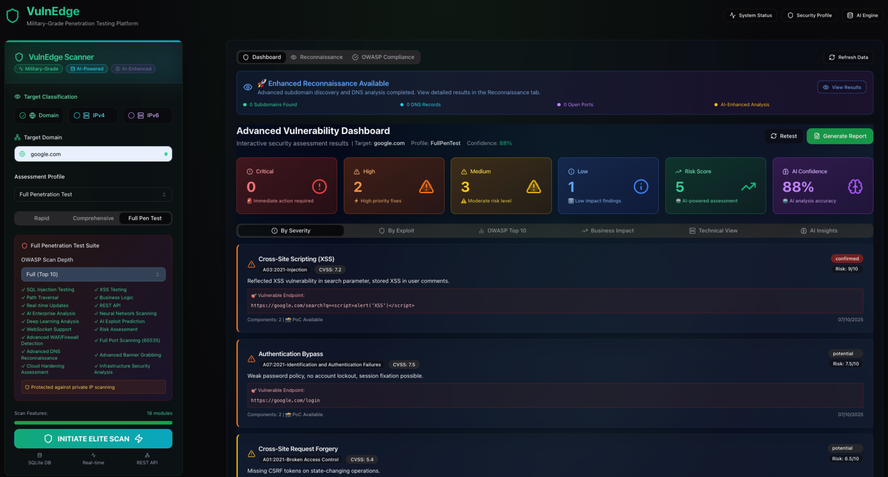
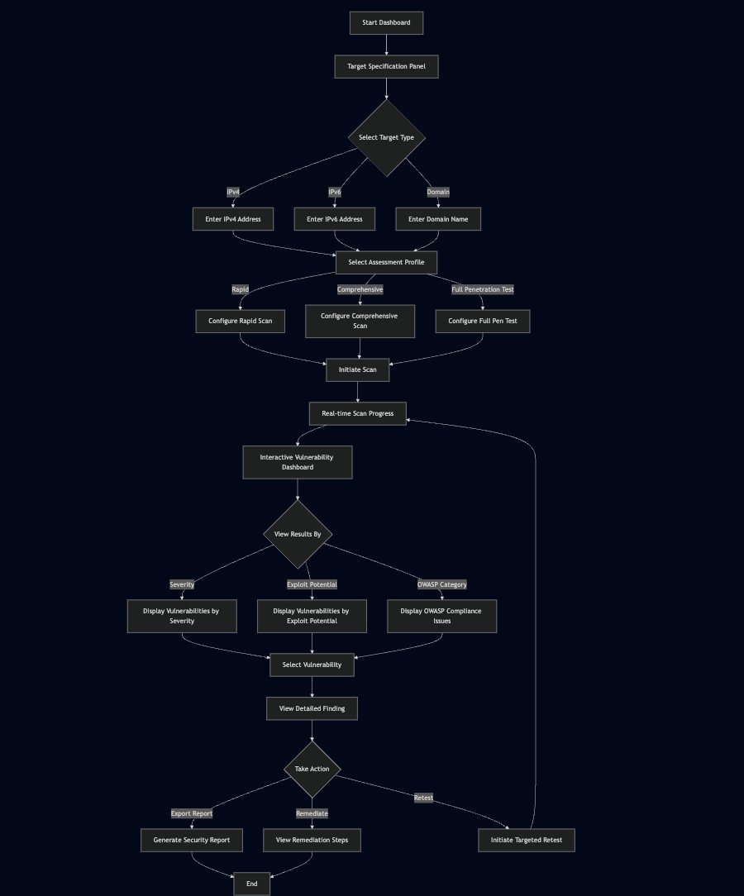

# AI-VAPT
🧠 AI-VAPT
Autonomous AI-Driven Vulnerability Assessment & Penetration Testing Framework

AI-VAPT (Artificial Intelligence – Vulnerability Assessment and Penetration Testing) is a next-generation, fully automated cybersecurity framework that merges artificial intelligence, automation, and traditional penetration testing methodologies to deliver a self-learning, adaptive, and accurate security assessment engine.

It’s designed for pentesters, red teams, and security researchers who want to move beyond manual recon and exploit discovery — into an AI-augmented security testing era.

⚡ Key Highlights

🤖 AI-Augmented Reconnaissance — Uses neural pattern recognition to find hidden assets, misconfigured endpoints, and shadow subdomains.

🔍 Automated Multi-Vector Scanning — Performs Web, Network, API, Cloud, and IoT scans with intelligent prioritization.

🔬 Machine Learning Exploit Prediction — Detects exploitability levels using ML-based vulnerability scoring models.

📊 Smart Reporting Engine — Generates detailed PDF/HTML reports with severity ranking, impact mapping, and remediation paths.

🔒 Privacy by Design — Zero data stored, zero data reused. Fully offline-capable operation mode.

🧩 Modular & Extensible Architecture — Easily plug in new scanners, ML models, or third-party tools.

⚙️ Continuous Security Validation — Supports automated periodic testing pipelines through CI/CD integration.

🧠 Architecture Overview
Layer	Description
AI Layer	NLP-driven analysis for exploit prediction, CVE correlation, and anomaly detection.
Recon Layer	Subdomain, DNS, Port, Directory, and Service enumeration using hybrid AI+dictionary techniques.
Vulnerability Layer	CVE mapping, version fingerprinting, misconfiguration detection, and exploit validation.
Exploitation Layer	Controlled exploitation simulation and payload validation (safe mode).
Reporting Layer	Risk-based visual reporting engine with auto-generated insights and recommendations.
🧰 Integrated Tools

Reconnaissance: Amass, Subfinder, Nmap, Shodan API, CRT.sh

Web Scanning: Nikto, Dirsearch, Wapiti, BurpSuite API

Exploit Mapping: CVE Trends, Exploit-DB, ML-based CVE Exploitability Model

Post-Exploitation: Metasploit integration, local privilege check, token dumping modules

Reporting: AI-generated executive and technical summaries

🧑‍💻 Use Cases

Automated Red Team Assessments

Continuous Vulnerability Management

AI-assisted Bug Bounty Recon

SOC Validation Testing

Compliance Audits (ISO 27001, NIST, PCI-DSS, etc.)

🧩 1. Prerequisites

#Make sure you have Node.js and npm (or yarn/pnpm) installed:
node -v
npm -v

#If not installed, run:
sudo apt update
sudo apt install nodejs npm -y

🚀 Getting Started
# Clone the repository
git clone https://github.com/devTanmayBang2104/VAPT.git

# Navigate to project folder
cd AI-VAPT

# Install dependencies
npm install

# or (if using yarn)
yarn install

# Start the development server
npm run dev

Then open the displayed local URL (usually http://localhost:5173) in your browser.

# (Optional) Build for production
npm run build

📈 Future Roadmap

🔹 Integration with LLM-based reasoning engines for contextual vulnerability explanation

🔹 Real-time exploit chain mapping visualization

🔹 Threat intelligence enrichment through OSINT automation

🔹 Cloud-native agent for AWS, Azure, and GCP audits

🛡️ Philosophy

“Security is no more an option — Privacy by design, trust by vision.”
— Tanmay Bang
