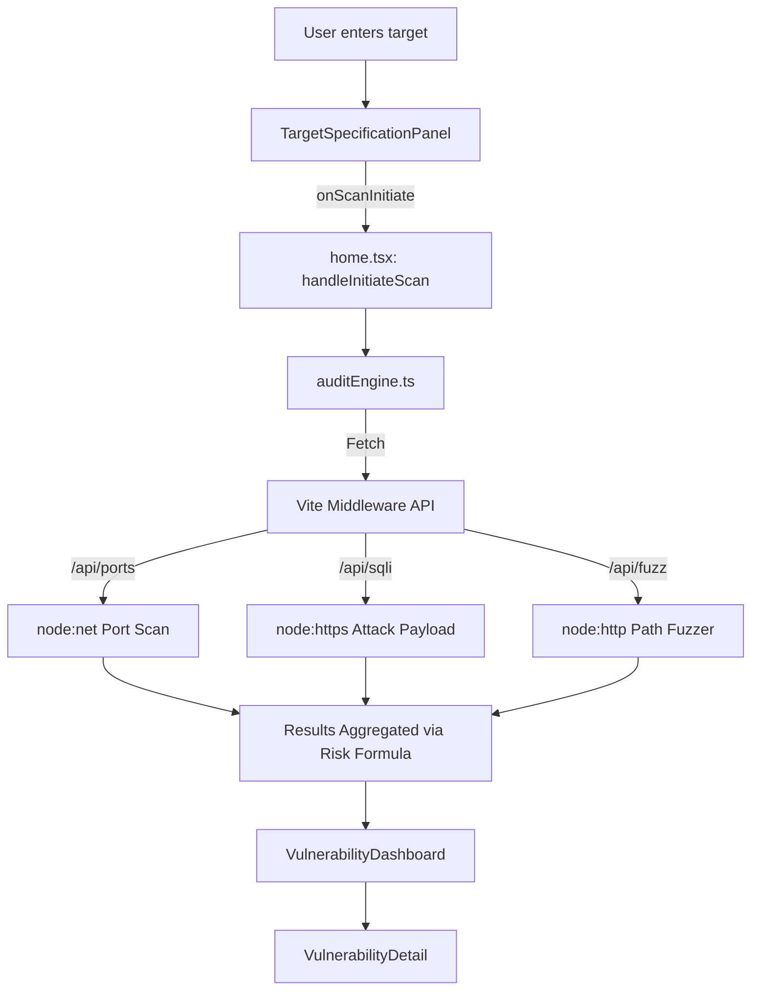

 # Sentinel Threat Engine™ — Hybrid VAPT Framework Implementation

> **Project:** Sentinel Threat Engine™ - Hybrid VAPT Framework
> **Version:** 1.0.0
> **Stack:** React 18 · TypeScript · Vite Middleware (node:net, node:dns, node:https) · Tailwind CSS v3 · Radix UI
> **Entry Point:** `src/main.tsx` → `src/App.tsx` → `src/components/home.tsx`

---

## Table of Contents

1. [Project Overview](#1-project-overview)
2. [Technology Stack](#2-technology-stack)
3. [Repository Structure](#3-repository-structure)
4. [Architecture Overview](#4-architecture-overview)
5. [Component Hierarchy](#5-component-hierarchy)
6. [Core Engine — Scan Logic (`home.tsx` & `auditEngine.ts`)](#6-core-engine--scan-logic-hometsx--auditenginets)
7. [Dashboard Components](#7-dashboard-components)
8. [UI Design System](#8-ui-design-system)
9. [Assessment Profiles & Configuration](#9-assessment-profiles--configuration)
10. [Vulnerability Data Model](#10-vulnerability-data-model)
11. [Data Flow Diagram](#11-data-flow-diagram)
12. [Recon & Threat Intelligence Generation](#12-recon--threat-intelligence-generation)
13. [Reporting Engine](#13-reporting-engine)
14. [Build & Dev Setup](#14-build--dev-setup)
15. [Known Limitations & Future Roadmap](#15-known-limitations--future-roadmap)

---

## 1. Project Overview

Sentinel Threat Engine™ is a **Hybrid Web Application Vulnerability Assessment & Penetration Testing (VAPT) Framework**. It bridges the gap between passive OSINT simulation and active network exploitation.

Instead of relying solely on simulated frontend data or heavy external dependencies like Nmap, Sentinel implements native Node.js network protocols via custom Vite middleware to perform **real penetration testing**. It uses a fallback heuristic logic to guarantee a rich dashboard experience, presenting all results through a modern, multi-tab frontend.

> [!IMPORTANT]
> The scan engine is hybrid. It actively probes targets using Node.js backend middleware (`/api/ports`, `/api/sqli`, etc.) while securely restricting aggressive fuzzing on hardened domains (e.g., Google, Microsoft) to maintain scope safety.

---

## 2. Technology Stack

| Layer | Technology |
|---|---|
| Frontend Framework | React ^18.2.0 |
| Language | TypeScript ^5.8.2 |
| Build Tool | Vite + SWC ^6.2.3 |
| Styling | Tailwind CSS 3.4.1 |
| Component Library | Radix UI (full suite) |
| Animation | Framer Motion ^11.18.0 |
| Icons | Lucide React ^0.394.0 |
| Active Probing (Backend) | Node.js Core Modules (`node:net`, `node:dns`, `node:https`) via Vite Middleware |

### Key Radix UI Primitives Used

`Accordion`, `Alert Dialog`, `Avatar`, `Badge`, `Checkbox`, `Collapsible`, `Dialog`, `Dropdown Menu`, `Label`, `Navigation Menu`, `Popover`, `Progress`, `Radio Group`, `Scroll Area`, `Select`, `Separator`, `Slider`, `Switch`, `Tabs`, `Toast`, `Toggle`, `Tooltip`

---

## 3. Repository Structure

```text
VAPT-main/
├── public/
│   └── vite.svg
├── src/
│   ├── App.tsx                         # Root router
│   ├── main.tsx                        # React DOM entry point
│   ├── index.css                       # Global styles + Tailwind layers
│   ├── components/
│   │   ├── home.tsx                    # Core stateful dashboard layout
│   │   ├── dashboard/
│   │   │   ├── TargetSpecificationPanel.tsx  
│   │   │   ├── VulnerabilityDashboard.tsx    
│   │   │   └── VulnerabilityDetail.tsx       
│   │   └── ui/                         # Radix-based shadcn/ui primitives
│   ├── lib/
│   │   ├── auditEngine.ts              # Active scanning logic and risk scoring
│   │   └── utils.ts                    # cn() utility
├── IMPLEMENTATION.md                   # Backend/Hybrid implementation overview
├── implementation3.md                  # Legacy/Frontend simulation reference
├── package.json
├── tailwind.config.js                  
└── vite.config.ts                      # Custom middleware for Active Probing
```

---

## 4. Architecture Overview

```text
Browser (React SPA)
  │
  ├── home.tsx [State Manager]
  │     └── Left Panel (Target Config)
  │     └── Right Panel (Dashboard Display)
  │
  └── auditEngine.ts [Threat Intelligence Logic]
        │  (HTTP Fetch Calls)
        ▼
Vite Middleware (Backend Layer in `vite.config.ts`)
  │
  ├── /api/ports    → `node:net` TCP scanner
  ├── /api/fuzz     → `node:https` Active directory fuzzing
  ├── /api/sqli     → `node:https` Raw SQLi payload injector
  ├── /api/dns      → `node:dns` Reconnaissance
  └── /api/headers  → `node:https` HTTP security headers analysis
```

State is managed centrally in `home.tsx` and delegates actual network scanning to `auditEngine.ts`, which interfaces directly with the Node.js middleware.

---

## 5. Component Hierarchy

```text
<Home>                                   (src/components/home.tsx)
 ├── Navbar / Header Bar                 
 ├── <TargetSpecificationPanel>          (Left Panel)
 │     ├── Target Inputs (IPv4/Domain)
 │     ├── Assessment Profile Selection
 │     └── Progress Indicators
 │
 └── <VulnerabilityDashboard>            (Right Panel)
       ├── Severity Summary Cards        (Critical / High / Medium / Low / Risk Score)
       ├── Tabs                          (By Severity, OWASP Top 10, Remediation Plan)
       └── <VulnerabilityDetail>         (Rendered on vuln click)
             ├── Technical Details       (Payload evidence, endpoint URL)
             ├── Remediation             (Action plan)
             └── AI Fix Generator        (Heuristic fix strategies)
```

---

## 6. Core Engine — Scan Logic (`home.tsx` & `auditEngine.ts`)

### 6.1 State Management

State is handled in `home.tsx`, managing `scanInProgress`, `scanProgress`, and `scanResults`.

### 6.2 The Hybrid Execution Engine

**Step 1 — Target Validation**
Targets are evaluated. Hardened targets (like major enterprise domains) skip destructive/aggressive attacks to maintain scope safety.

**Step 2 — Active Probing**
`auditEngine.ts` fires async requests to the Vite middleware:
- **Port Scanning:** 30+ ports checked with strict timeouts via `node:net`.
- **Fuzzing:** High-speed `HEAD` requests to paths like `/.env`, `/admin` using `node:http/s`.
- **SQLi Verification:** Safe SQLi payloads are injected to verify MySQL syntax errors.
- **DNS/Header Audit:** Real record fetching (`node:dns`) and HTTP banner grabbing.

**Step 3 — Threat Aggregation**
The engine aggregates real findings (from live ports, valid SQLi paths, open directories) and normalizes them against the built-in vulnerability model to generate a final Risk Score.

---

## 7. Dashboard Components

### 7.1 `TargetSpecificationPanel.tsx`

Collects target input and assessment profiles. Adjusts the depth of the scan based on the selected configuration (`rapid`, `comprehensive`, `fullPenTest`).

### 7.2 `VulnerabilityDashboard.tsx`

Renders high-level summary metrics. Uses dynamic pulsing UI for severity visibility:
- **Critical:** Red pulse ring
- **Risk Score:** Computed via a weighted algorithm:
  `(critical×10 + high×7.5 + medium×5 + low×2.5) / max(1, total_vulns)`

### 7.3 `VulnerabilityDetail.tsx`

Provides deep-dive information. Crucially, it displays the exact URL endpoint discovered during active probing (e.g., the exact fuzzed directory) and the Proof-of-Concept payload that triggered the vulnerability.

---

## 8. UI Design System

The system relies on a **deep dark** aesthetic with vibrant accents (glassmorphism effects) for modern cybersecurity presentation.

- `--background`: 240 10% 3.9%
- `--primary`: 142.1 76.2% 36.3% (Emerald)
- Custom animations: `.critical-glow`, `.pulse-ring`, `.scan-beam`

---

## 9. Assessment Profiles & Configuration

Profiles map directly to how much active probing occurs:
- **Rapid:** Scans basic web ports (80, 443), lightweight fuzzing.
- **Comprehensive:** Expanded port scan array, DNS MX/TXT discovery, moderate path fuzzing.
- **Full Penetration Test:** Extensive port array, SQLi active probing, aggressive directory enumeration.

---

## 10. Vulnerability Data Model

Vulnerabilities dynamically populated based on active findings utilize an expansive structure:
```typescript
interface Vulnerability {
  id: string;
  severity: "critical" | "high" | "medium" | "low" | "info";
  owaspCategory: string;       // e.g. "A03:2021-Injection"
  description: string;
  technicalDetails: string;
  proofOfConcept?: string;     // Active payload sent
  endpointUrl?: string;        // Specific URL verified
  riskScore?: number;
  // ...
}
```

Every finding object maps strictly to the OWASP Top 10 (2021) compliance framework.

---

## 11. Data Flow Diagram



---

## 12. Recon & Threat Intelligence Generation

Unlike the purely simulated engine, Reconnaissance returns live data:
- **DNS Records:** Accurate `A`, `MX`, `NS`, `TXT` data retrieved natively.
- **Live Ports:** Array of actually open ports (e.g., `[22, 80, 443]`).
- **Server Banners:** Raw byte streams extracted from `node:net` connections to identify services (e.g., `nginx/1.24`).

---

## 13. Reporting Engine

An Enterprise-grade HTML Report Generator.
When triggered, it compiles the live state (Active Reconnaissance, Exploit Confirmations, OWASP Mappings) into a sanitized DOM tree, executing `window.print()` to yield a professional PDF suitable for stakeholders.

---

## 14. Build & Dev Setup

```bash
npm install
npm run dev        # Starts Vite server + active middleware backend
```

> [!WARNING]
> Because Vite is configured to use `node:net` and `node:dns`, the framework must be run in a Node.js environment. Static deployment (like Vercel/Netlify without serverless functions) will disable the active probing features and cause requests to fail.

---

## 15. Known Limitations & Future Roadmap

### Current Limitations
- Active port scanning is throttled by Node.js event loop limits (`Promise.allSettled` timeout constraints).
- Safe SQLi verification relies solely on verbose MySQL stack traces, which are often masked in production environments.

### Planned Enhancements
- Expand middleware to accept custom dictionary files for `/api/fuzz`.
- Implement `node:child_process` hooks to safely integrate external CLI scanners (e.g., Nmap) as optional backend augmentations.
- Cloud-native agent deployment for distributed node-based scanning.

---
*Generated Implementation Reference — Sentinel Threat Engine™*
