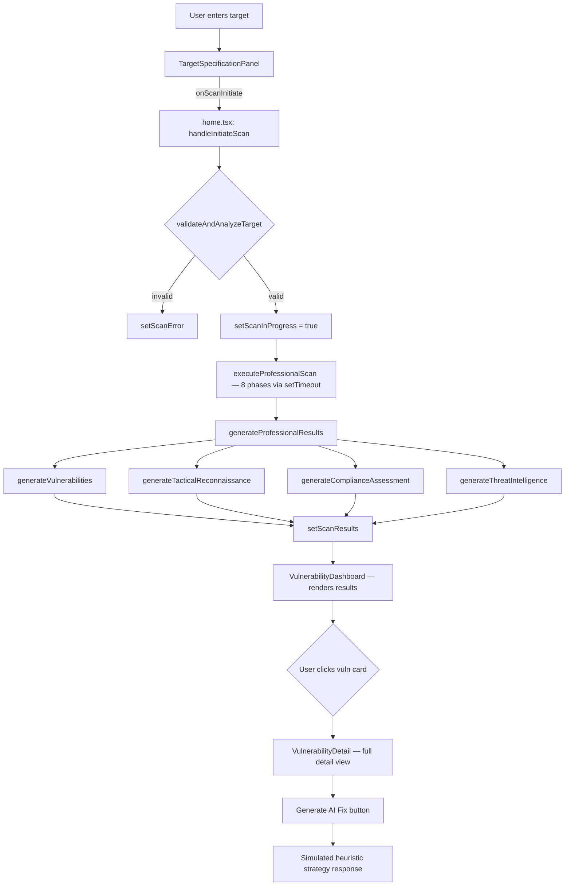

# AI-VAPT — Implementation Document

> **Project:** AI-VAPT — Autonomous AI-Driven Vulnerability Assessment & Penetration Testing Framework  
> **Version:** 0.0.0  
> **Stack:** React 18 · TypeScript · Vite · Tailwind CSS v3 · Radix UI · Framer Motion  
> **Entry Point:** `src/main.tsx` → `src/App.tsx` → `src/components/home.tsx`

---

## Table of Contents

1. [Project Overview](#1-project-overview)
2. [Technology Stack](#2-technology-stack)
3. [Repository Structure](#3-repository-structure)
4. [Architecture Overview](#4-architecture-overview)
5. [Component Hierarchy](#5-component-hierarchy)
6. [Core Engine — Scan Logic (`home.tsx`)](#6-core-engine--scan-logic-hometsx)
7. [Dashboard Components](#7-dashboard-components)
8. [UI Design System](#8-ui-design-system)
9. [Assessment Profiles & Configuration](#9-assessment-profiles--configuration)
10. [Vulnerability Data Model](#10-vulnerability-data-model)
11. [Data Flow Diagram](#11-data-flow-diagram)
12. [Recon & Threat Intelligence Generation](#12-recon--threat-intelligence-generation)
13. [Reporting Engine](#13-reporting-engine)
14. [Build & Dev Setup](#14-build--dev-setup)
15. [Known Limitations & Future Roadmap](#15-known-limitations--future-roadmap)

---

## 1. Project Overview

AI-VAPT is a **frontend-only, browser-based VAPT simulation framework** built as a React SPA. It provides a realistic security assessment experience by:

- Accepting a target (Domain / IPv4 / IPv6).
- Running through **8 simulated scan phases** with real-time progress.
- Generating heuristically derived vulnerability findings, reconnaissance data, compliance assessments, and threat intelligence.
- Presenting all results through a richly styled, multi-tab dashboard.

> [!IMPORTANT]
> The scan engine runs entirely in the browser via `setTimeout`-driven phase simulation. No real network traffic is generated. All findings are generated heuristically based on target characteristics.

---

## 2. Technology Stack

| Layer | Technology | Version |
|---|---|---|
| Framework | React | ^18.2.0 |
| Language | TypeScript | ^5.8.2 |
| Build Tool | Vite + SWC | ^6.2.3 |
| Styling | Tailwind CSS | 3.4.1 |
| Component Library | Radix UI (full suite) | various |
| Animation | Framer Motion | ^11.18.0 |
| Icons | Lucide React | ^0.394.0 |
| PDF Export | jsPDF + html2canvas | ^3.0.2 / ^1.4.1 |
| Routing | React Router DOM | ^6.23.1 |
| Form Handling | React Hook Form + Zod | ^7.51.5 / ^3.23.8 |
| Dev Tooling | Tempo DevTools | ^2.0.109 |
| Backend (future) | Supabase JS | ^2.45.6 |

### Key Radix UI Primitives Used

`Accordion`, `Alert Dialog`, `Avatar`, `Badge`, `Checkbox`, `Collapsible`, `Dialog`, `Dropdown Menu`, `Label`, `Navigation Menu`, `Popover`, `Progress`, `Radio Group`, `Scroll Area`, `Select`, `Separator`, `Slider`, `Switch`, `Tabs`, `Toast`, `Toggle`, `Tooltip`

---

## 3. Repository Structure

```
VAPT-main/
├── public/
│   └── vite.svg
├── src/
│   ├── App.tsx                         # Root router — renders <Home /> at "/"
│   ├── main.tsx                        # React DOM entry point
│   ├── index.css                       # Global styles + Tailwind layers + custom CSS classes
│   ├── components/
│   │   ├── home.tsx                    # Core scan engine + master layout (3229 lines)
│   │   ├── EnhancedReconnaissance.tsx  # Alternative recon view (unused in main route)
│   │   ├── ProfessionalReconnaissance.tsx  # Professional recon view (unused in main route)
│   │   ├── dashboard/
│   │   │   ├── TargetSpecificationPanel.tsx  # Left panel — target input + profile config
│   │   │   ├── VulnerabilityDashboard.tsx    # Right panel — results display (1394 lines)
│   │   │   └── VulnerabilityDetail.tsx       # Full detail view for a selected vuln
│   │   └── ui/                         # 44 Radix-based shadcn/ui primitives
│   ├── lib/
│   │   └── utils.ts                    # cn() utility (clsx + tailwind-merge)
│   ├── stories/                        # Storybook stories (scaffolded)
│   └── types/
│       └── supabase.ts                 # Auto-generated Supabase types (placeholder)
├── index.html                          # Vite HTML entry
├── package.json
├── tailwind.config.js                  # Extended theme + custom animations + shadcn tokens
├── vite.config.ts                      # Vite + SWC + Tempo plugin + @ alias
├── tsconfig.json
├── Dashboard.png                       # Reference screenshot
└── Flowchart.png                       # Architecture flowchart
```

---

## 4. Architecture Overview

```
Browser
  │
  └── React SPA (Vite)
        │
        ├── App.tsx  [React Router]
        │     └── Route "/" → <Home />
        │
        └── home.tsx  [Stateful Scan Engine]
              │
              ├── State:
              │     scanInProgress, scanProgress, scanResults,
              │     selectedTab, scanError, hasPerformedScan
              │
              ├── Left Panel → <TargetSpecificationPanel />
              │     Emits: onScanInitiate(targetData)
              │
              └── Right Panel → <VulnerabilityDashboard />
                    Props: vulnerabilities, scanMetadata,
                           scanInProgress, scanProgress,
                           hasPerformedScan
                    Child: <VulnerabilityDetail />
                           (rendered on vuln click)
```

**State is owned exclusively in `home.tsx`**. All sub-components are purely presentational, driven by props.

---

## 5. Component Hierarchy

```
<Home>                                   (src/components/home.tsx)
 ├── Navbar / Header Bar                 (inline JSX)
 ├── <TargetSpecificationPanel>          (dashboard/TargetSpecificationPanel.tsx)
 │     ├── RadioGroup   [targetType]
 │     ├── Input        [targetValue]
 │     ├── Select       [assessmentProfile]
 │     ├── Tabs         [profile config]
 │     │     ├── rapid
 │     │     ├── comprehensive
 │     │     └── fullPenTest
 │     ├── Progress     [module count indicator]
 │     └── Button       [START VAPT SCAN]
 │
 └── <VulnerabilityDashboard>            (dashboard/VulnerabilityDashboard.tsx)
       ├── Scan progress card            (shown while scanInProgress)
       │     └── Progress bar + phase icons
       ├── Empty state                   (shown before first scan)
       ├── Severity summary cards        (Critical / High / Medium / Low / Risk Score / Integrity)
       ├── Tabs
       │     ├── By Severity             → sorted vuln cards
       │     ├── By Exploit              → sorted by exploitability
       │     ├── OWASP Top 10            → sorted by category
       │     ├── Business Impact         → $K estimates + effort
       │     ├── Technical View          → server/infra details
       │     └── Remediation Plan        → AI-assisted fix suggestions
       └── <VulnerabilityDetail>         (dashboard/VulnerabilityDetail.tsx)
             ├── Overview tab            (description, severity, affected components)
             ├── Technical Details tab   (raw analysis, endpoint URL, PoC)
             ├── Remediation tab         (actions + checklist accordion)
             ├── References tab          (OWASP/CWE links)
             └── AI Fix Generator        (simulated heuristic strategy generation)
```

---

## 6. Core Engine — Scan Logic (`home.tsx`)

### 6.1 State

```typescript
const [scanInProgress, setScanInProgress]   = useState(false);
const [scanProgress, setScanProgress]       = useState(0);       // 0–100
const [scanResults, setScanResults]         = useState<any>(null);
const [selectedTab, setSelectedTab]         = useState("dashboard");
const [scanError, setScanError]             = useState<string | null>(null);
const [hasPerformedScan, setHasPerformedScan] = useState(false);
```

### 6.2 Scan Initiation — `handleInitiateScan()`

**Step 1 — Target Validation** (`validateAndAnalyzeTarget`)

| Target Type | Validation | Risk Levels Assigned |
|---|---|---|
| `ipv4` | Regex + RFC-1918 octet check | `internal`, `localhost`, `external` |
| `ipv6` | Regex + `::1` detection | `localhost`, `external` |
| `domain` | Regex + TLD + domain allowlist | `hardened`, `vulnerable-demo`, `high-profile`, `standard` |

Hardened domains (Google, Microsoft, GitHub, Cloudflare, etc.) are automatically identified and produce minimal/no findings — simulating a realistic posture.

**Step 2 — Phase Simulation** (`executeProfessionalScan`)

8 sequential phases driven by `setTimeout` chains:

| # | Phase | Duration | Progress |
|---|---|---|---|
| 1 | OSINT & DNS Reconnaissance | 800 ms | 10% |
| 2 | Service & Port Enumeration | 1000 ms | 25% |
| 3 | Web Application Fingerprinting | 1200 ms | 40% |
| 4 | Security Headers & SSL Audit | 1500 ms | 55% |
| 5 | Vulnerability Pattern Matching | 1400 ms | 70% |
| 6 | OWASP Top 10 Analysis | 1200 ms | 85% |
| 7 | Risk Assessment & Prioritization | 1000 ms | 95% |
| 8 | Generating Final Report | 600 ms | 100% |

**Step 3 — Result Generation** (`generateProfessionalResults`)

Calls four sub-generators in sequence:
- `generateVulnerabilities()` — filters the pool based on target posture
- `generateTacticalReconnaissance()` — simulates asset/port/tech discovery
- `generateComplianceAssessment()` — maps to ISO 27001, PCI-DSS, NIST, etc.
- `generateThreatIntelligence()` — enriches with threat actor context

Results are assembled into `scanResults` and passed to `<VulnerabilityDashboard />`.

### 6.3 Heuristic Analysis — `performHeuristicAnalysis()`

```typescript
{
  isHardened: boolean,       // true for enterprise domains
  isDemo: boolean,           // true for known vulnerable targets (vulnweb, dvwa, etc.)
  hasAdminInterfaces: boolean,
  isLegacyInfrastructure: boolean,
  isHighValueTarget: boolean,
  securityPosture: "hardened" | "vulnerable" | "standard",
  sslStatus: "secure" | "potential-risks",
  vulnerabilityHeuristics: {
    patternMatchDepth: 0.3 | 0.6 | 0.95,
    heuristicConfidence: 0.85 | 0.95,
  }
}
```

### 6.4 Confidence Scoring — `calculateConfidence()`

| Profile | Base | Bonus | Max |
|---|---|---|---|
| rapid | 85% | — | 85% |
| comprehensive | 85% | +5% | 90% |
| fullPenTest | 85% | +10% | 95% |

Hard cap at **99%**.

---

## 7. Dashboard Components

### 7.1 `TargetSpecificationPanel.tsx`

**Responsibilities:**
- Collect `targetType` (domain / ipv4 / ipv6)
- Collect `targetValue` (user input)
- Select `assessmentProfile` (rapid / comprehensive / fullPenTest)
- Show per-profile feature flags via Tabs
- Emit `onScanInitiate(targetData)` on button click

**Configuration Object Shape:**
```typescript
configOptions: {
  rapid:         { portScan: "top-100", webScan: true, sslScan: true, ... },
  comprehensive: { portScan: "top-1000", dnsRecon: true, subdomainEnum: true, ... },
  fullPenTest:   { portScan: "all", owaspScan: true, exploitAnalysis: true, ... }
}
```

The button is **disabled** when `targetValue` is empty.

---

### 7.2 `VulnerabilityDashboard.tsx`

**Summary cards (6):**

| Card | Metric | Color |
|---|---|---|
| Critical | Count | Red with ping animation |
| High | Count | Orange with pulse ring |
| Medium | Count | Yellow with pulse ring |
| Low + Info | Count | Blue |
| Risk Score | Weighted formula | Emerald |
| Scan Integrity | Confidence % | Purple |

**Risk Score formula:**
```
(critical×10 + high×7 + medium×4 + low×2) / max(1, total_vulns)
```

**View Tabs (6):**

| Tab | Sort / Group |
|---|---|
| By Severity | critical > high > medium > low > info |
| By Exploit | confirmed > potential > unlikely |
| OWASP Top 10 | Alphabetical by OWASP category |
| Business Impact | Financial ($K), compliance %, remediation days |
| Technical View | Server, port, service details |
| Remediation Plan | Per-vuln guided fix steps |

---

### 7.3 `VulnerabilityDetail.tsx`

Displayed when any vulnerability card is clicked. Shows:

- **Overview tab** — description, CVSS, exploit potential, discovery date, affected components
- **Technical Details tab** — full technical analysis text, vulnerable endpoint (monospace + copy button), Proof-of-Concept payload, optional PoC screenshot
- **Remediation tab** — remediation text + auto-generated Accordion checklist
- **References tab** — clickable OWASP/CWE/NIST resource links
- **AI Fix Generator** — `Generate AI Fix` button triggers a 2-second simulated LLM response returning one of 3 heuristic remediation strategies

---

## 8. UI Design System

### 8.1 Color Tokens (`src/index.css`)

The theme is **deep dark** with emerald/cyan as the primary accent pair.

```css
--background:          240 10% 3.9%       /* near-black */
--foreground:          0 0% 98%           /* white text */
--primary:             142.1 76.2% 36.3%  /* emerald */
--ring:                142.1 76.2% 36.3%
--destructive:         0 84.2% 60.2%      /* red */
--radius:              0.75rem
```

### 8.2 Custom CSS Classes

| Class | Effect |
|---|---|
| `.scanner-card` | `backdrop-blur-sm`, `border/50`, `shadow-xl`, `rounded-xl` |
| `.scanner-button` | gradient, scale-on-hover, active-press |
| `.vulnerability-card` | hover shadow + border brightening |
| `.critical-glow` | `box-shadow` with red hue |
| `.high-glow` | `box-shadow` with orange hue |
| `.medium-glow` | `box-shadow` with yellow hue |
| `.glass-effect` | `bg-background/80 backdrop-blur-md` |
| `.pulse-ring` | pulsing ring keyframes (scale 0.33 → 2.33) |
| `.floating` | vertical float keyframes (0 → -6px → 0) |
| `.scan-beam` | horizontal sweep keyframes |
| `.modern-text` | `font-weight: 600`, tight letter-spacing |

### 8.3 Tailwind Config Extensions

- Custom `scanner` button variant
- Extended color palette for severity grades
- `tailwindcss-animate` plugin for `animate-in` / `slide-in-from-bottom-4`

---

## 9. Assessment Profiles & Configuration

### Rapid Assessment
- Top 100 port scan
- Basic web scanning
- SSL/TLS check
- Heuristic analysis
- **6 modules**, ~2–3 min simulated

### Comprehensive Audit
- Top 1000 port scan
- DNS reconnaissance + subdomain enumeration
- Technology fingerprinting
- Vulnerability scanning
- Auth testing + web crawling
- Advanced WAF/DNS/banner-grab
- Cloud hardening check
- **12 modules**, ~8–12 min simulated

### Full Penetration Test
- All 65535 ports
- Full OWASP Top 10 testing (SQL injection, XSS, path traversal, business logic)
- Exploit analysis + risk assessment
- Real-time updates
- REST API integration
- Statistical analysis + exploit prediction
- WebSocket support
- **18 modules**, ~25–35 min simulated

---

## 10. Vulnerability Data Model

```typescript
interface Vulnerability {
  id: string;                    // e.g. "vapt-sqli-001"
  name: string;
  title: string;
  severity: "critical" | "high" | "medium" | "low" | "info";
  exploitPotential: "easy" | "moderate" | "difficult" | "confirmed" | "potential" | "unlikely";
  category: string;              // "application" | "infrastructure" | "web-config" | "access-control"
  owaspCategory: string;         // e.g. "A03:2021-Injection"
  description: string;
  impact: string;
  remediation: string;
  technicalDetails: string;
  references: { title: string; url: string }[];
  cvss?: number;                 // CVSS 3.x score
  cve?: string;
  discoveredAt: string;          // ISO timestamp
  status: "open" | "in-progress" | "resolved" | "false-positive";
  affectedComponents: string[];
  proofOfConcept?: string;
  pocScreenshot?: string;
  endpointUrl?: string;
  exploitComplexity?: string;
  riskScore?: number;
  businessImpact?: string;
  attackVector?: string;
  dataClassification?: string;
}
```

### Built-in Vulnerability Pool

| ID | Name | Severity | CVSS | OWASP |
|---|---|---|---|---|
| vapt-sqli-001 | SQL Injection Potential | **Critical** | 9.8 | A03:2021 |
| vapt-inf-001 | Sensitive Data in Config Files | **Critical** | 9.1 | A04:2021 |
| vapt-xss-001 | Reflected XSS | **High** | 7.2 | A03:2021 |
| vapt-adm-001 | Exposed Admin Interface | **High** | 7.5 | A01:2021 |
| vapt-idor-001 | IDOR | **High** | 7.5 | A01:2021 |
| vapt-ssl-001 | Weak TLS Configuration | **Medium** | 5.3 | A02:2021 |
| vapt-auth-001 | Weak Password Policy | **Medium** | 5.7 | A07:2021 |
| vapt-dir-001 | Directory Listing Enabled | **Medium** | 5.3 | A05:2021 |
| vapt-hdr-001 | Missing Security Headers | **Low** | 3.5 | A05:2021 |
| vapt-dns-001 | Missing DNS Security Records | **Low** | 3.1 | A05:2021 |
| vapt-web-001 | Information Disclosure via Headers | **Low** | 2.1 | A05:2021 |

### Findings per Target Posture

| Target Type | Findings Returned |
|---|---|
| Hardened (Google, GitHub…) | 0–2 low/info only, no infrastructure |
| Demo (vulnweb, dvwa…) | 1 critical, 2 high, 1 medium, 1 low |
| Standard + Rapid | 2 web-config findings |
| Standard + Full Pen Test | 2 web-config + 1 high |

---

## 11. Data Flow Diagram



---

## 12. Recon & Threat Intelligence Generation

### Reconnaissance Output Shape

```typescript
{
  discoveredAssets: number,       // 2–20 depending on profile
  technologies: string[],         // web server, app stack, framework, DB, WAF
  potentialEntryPoints: number,
  openPorts: number[],            // e.g. [80, 443, 22, 3306]
  services: { port, service, version }[],
  subdomains: string[],
  dnsRecords: object[],
  certificates: object[],
  networkSegments: object[],
  osFingerprint: string | null,
  serviceVersions: Record<number, string>,
  securityMechanisms: string[]
}
```

**Port Ranges by Profile:**

| Profile | Ports |
|---|---|
| Rapid | `[80, 443]` (hardened) / `[22, 80, 443]` (standard) |
| Comprehensive | + `[21, 53, 3306]` |
| Full Pen Test | + `[25, 110, 143, 5432, 8080]` |

---

## 13. Reporting Engine

The `Generate Report` button in `VulnerabilityDashboard` calls `onGenerateReport` (wired in `home.tsx`). Currently logs to console. The dependencies **jsPDF** and **html2canvas** are already installed, enabling full PDF export implementation.

**Planned report sections:**
1. Executive Summary — target info, scan profile, confidence
2. Risk Overview — severity distribution chart
3. Vulnerability Detail — per-finding description, CVSS, remediation
4. Reconnaissance Findings — asset discovery, open ports, technologies
5. Compliance Mapping — OWASP / NIST / ISO 27001 / PCI-DSS
6. Threat Intelligence — threat actors, attack patterns
7. Remediation Roadmap — prioritized action plan

---

## 14. Build & Dev Setup

### Prerequisites

```bash
node -v    # >= 18 recommended
npm -v
```

### Install & Run

```bash
git clone https://github.com/vikramrajkumarmajji/AI-VAPT.git
cd AI-VAPT
npm install
npm run dev        # dev server → http://localhost:5173
```

### Build for Production

```bash
npm run build       # tsc + vite build
npm run preview     # preview production bundle
```

### Path Alias

`@/` resolves to `src/` via `vite.config.ts`:
```typescript
resolve: { alias: { "@": path.resolve(__dirname, "./src") } }
```

### Environment Variables

| Variable | Description |
|---|---|
| `VITE_TEMPO` | Set to `"true"` to enable Tempo DevTools routes |
| `VITE_BASE_PATH` | Base path override for production deployment |
| `SUPABASE_PROJECT_ID` | For `npm run types:supabase` type generation |

---

## 15. Known Limitations & Future Roadmap

### Current Limitations

> [!WARNING]
> All scan results are **simulated** — no real network requests are made. This is a frontend demonstration framework.

- No persistent storage (results are lost on page refresh)
- The `Generate Report` button is not yet wired to jsPDF
- `EnhancedReconnaissance.tsx` and `ProfessionalReconnaissance.tsx` are built but not routed
- `supabase.ts` types are a placeholder (no active Supabase project connected)
- Duplicate vulnerability IDs in the pool (`vapt-dir-001`, `vapt-idor-001`, `vapt-inf-001` appear twice in the pool array)

### Planned Enhancements

| Priority | Feature |
|---|---|
| High | Wire `generateReport()` to jsPDF / html2canvas PDF export |
| High | Deduplicate vulnerability pool entries |
| Medium | Connect Supabase backend for scan history persistence |
| Medium | Route `EnhancedReconnaissance` and `ProfessionalReconnaissance` components |
| Medium | Replace `setTimeout` chain with Web Worker for non-blocking phase execution |
| Low | LLM integration (OpenAI / Groq) for real AI Fix generation |
| Low | Real-time exploit chain mapping visualization |
| Low | OSINT automation and threat intelligence enrichment |
| Low | Cloud-native agent for AWS / Azure / GCP audits |
| Low | CI/CD pipeline integration for continuous security validation |

---

## Appendix — Key File Sizes

| File | Lines | Bytes |
|---|---|---|
| `src/components/home.tsx` | 3,229 | 131 KB |
| `src/components/dashboard/VulnerabilityDashboard.tsx` | 1,394 | 64 KB |
| `src/components/dashboard/TargetSpecificationPanel.tsx` | 617 | 25 KB |
| `src/components/dashboard/VulnerabilityDetail.tsx` | 532 | 22 KB |
| `src/components/ProfessionalReconnaissance.tsx` | ~700 | 20 KB |
| `src/components/EnhancedReconnaissance.tsx` | ~700 | 20 KB |
| `src/index.css` | 300 | 7 KB |

---

*Document generated — 2026-04-28*
